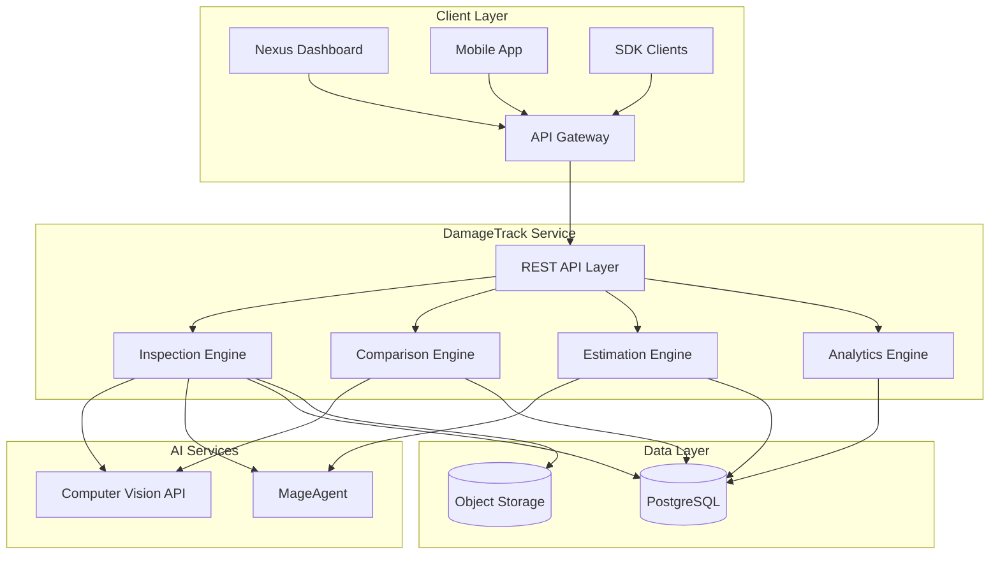
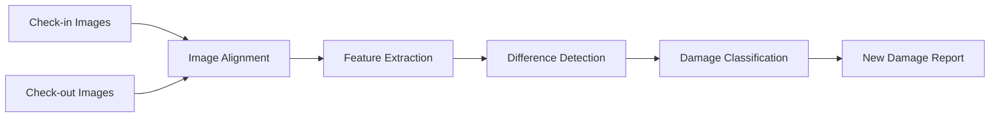
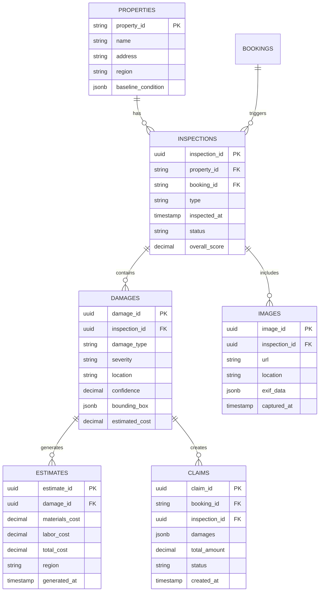
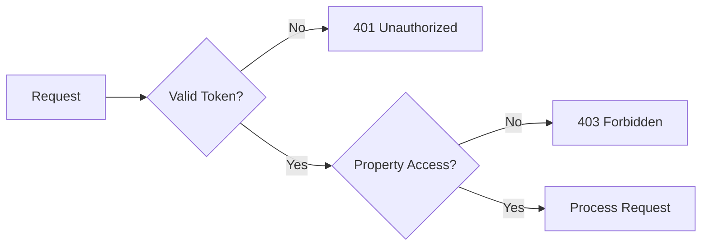
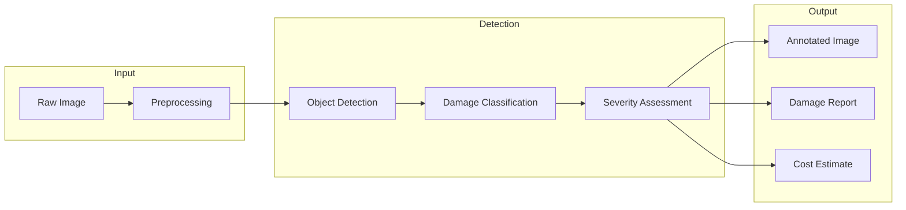

# DamageTrack Architecture

Technical architecture and system design for the AI-powered property damage detection plugin.

---

## System Overview



---

## Core Components

### 1. REST API Layer

| Endpoint | Method | Description |
|----------|--------|-------------|
| `/api/v1/inspect` | POST | Analyze images for damage |
| `/api/v1/reports/:propertyId` | GET | Get damage reports |
| `/api/v1/estimate` | POST | Generate cost estimate |
| `/api/v1/analytics` | GET | Get damage trends |

### 2. Inspection Engine

AI-powered damage detection using computer vision.

**Detection Capabilities:**
- Scratches and scuffs
- Stains and discoloration
- Cracks and chips
- Burns and heat damage
- Water damage
- Structural damage
- Furniture damage

**Confidence Scoring:**
- High (>90%): Clear, visible damage
- Medium (70-90%): Likely damage, may need review
- Low (<70%): Potential damage, requires verification

### 3. Comparison Engine

Compares before/after images to identify new damage.



**Comparison Methods:**
- Pixel-level difference detection
- Feature-based matching
- Semantic segmentation comparison
- Object detection comparison

### 4. Estimation Engine

Generates repair cost estimates based on damage type and severity.

**Data Sources:**
- Regional labor rates
- Material costs database
- Contractor quote history
- Insurance rate tables

### 5. Analytics Engine

Aggregates damage data for trend analysis.

**Metrics:**
- Damage frequency by property
- Cost trends over time
- Common damage types
- Recovery rate analysis

---

## Data Model



---

## Security Model

### Authentication
- Bearer token via Nexus API Gateway
- Signed URL generation for image uploads
- JWT validation with RS256

### Authorization
- Role-based: Property Manager, Inspector, Guest
- Property-level permissions
- Booking-scoped access for guests

### Data Protection
- Images encrypted at rest (AES-256)
- PII masking in reports
- GDPR-compliant data retention
- Audit trail for all access



---

## Deployment Architecture

### Kubernetes Configuration

```yaml
apiVersion: apps/v1
kind: Deployment
metadata:
  name: nexus-damagetracking
  namespace: nexus-plugins
spec:
  replicas: 3
  selector:
    matchLabels:
      app: nexus-damagetracking
  template:
    spec:
      containers:
      - name: damage-api
        image: adverant/nexus-damagetracking:1.0.0
        ports:
        - containerPort: 8080
        resources:
          requests:
            memory: "2Gi"
            cpu: "1000m"
          limits:
            memory: "4Gi"
            cpu: "2000m"
        env:
        - name: VISION_API_KEY
          valueFrom:
            secretKeyRef:
              name: damage-secrets
              key: vision-api-key
        livenessProbe:
          httpGet:
            path: /live
            port: 8080
        readinessProbe:
          httpGet:
            path: /ready
            port: 8080
```

### Resource Allocation

| Resource | Request | Limit |
|----------|---------|-------|
| CPU | 1000m | 2000m |
| Memory | 2Gi | 4Gi |
| Disk | 5Gi | 10Gi |

---

## Integration Points

### Computer Vision Pipeline



### MageAgent Integration

- **Image Analysis**: Multi-modal understanding of damage context
- **Report Generation**: Natural language damage descriptions
- **Cost Estimation**: Intelligent pricing based on market data

### Event Bus

| Event | Payload | Subscribers |
|-------|---------|-------------|
| `damage.detected` | Damage details | Alerts, Claims |
| `inspection.completed` | Inspection summary | PropertyMgmt, Reports |
| `claim.created` | Claim details | Billing, Notifications |

---

## Performance

### Image Processing

- **Preprocessing**: Resize to 1024px max, normalize
- **Batch Processing**: Up to 20 images per request
- **Caching**: Processed results cached for 24 hours

### Rate Limits

| Tier | Inspections/mo | Images/inspection |
|------|----------------|-------------------|
| Starter | 100 | 10 |
| Professional | 500 | 20 |
| Enterprise | Unlimited | 50 |

### Latency Targets

| Operation | Target | P99 |
|-----------|--------|-----|
| Single Image | 2s | 5s |
| Full Inspection (10 images) | 15s | 30s |
| Comparison | 5s | 10s |

---

## Monitoring

### Metrics (Prometheus)

```
# Inspection metrics
damage_inspections_total{type, status}
damage_detection_latency_seconds{image_count}
damage_confidence_score{damage_type}

# Cost metrics
damage_estimated_cost{severity, type}
damage_claim_amount{status}
damage_recovery_rate
```

### Alerting

| Alert | Condition | Severity |
|-------|-----------|----------|
| High False Positive Rate | >10% manual overrides | Warning |
| Processing Latency | P99 > 30s | Warning |
| Vision API Errors | >1% error rate | Critical |

---

## Disaster Recovery

- **RPO**: 1 hour (database), 24 hours (images)
- **RTO**: 15 minutes (API), 1 hour (full restore)
- **Image Backup**: Cross-region replication
- **Database**: Point-in-time recovery

---

## Next Steps

- [Quick Start Guide](./QUICKSTART.md) - Get started quickly
- [Use Cases](./USE-CASES.md) - Implementation scenarios
- [API Reference](./docs/api-reference/endpoints.md) - Complete docs
