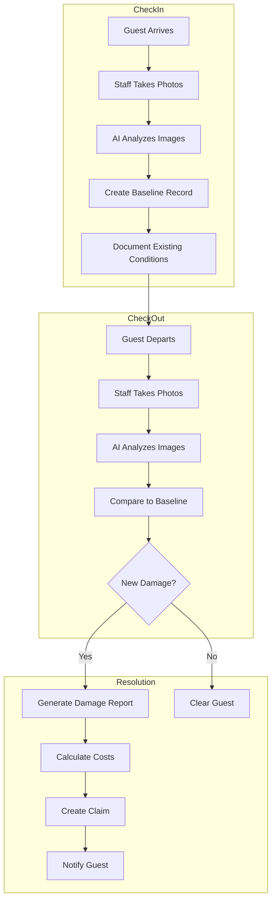
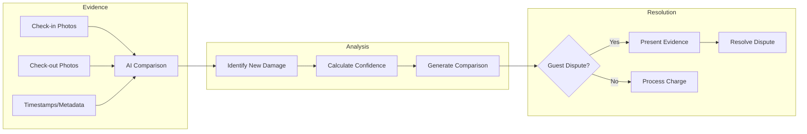

# DamageTrack Use Cases

Real-world implementation scenarios for AI-powered property damage detection and tracking.

---

## Use Case 1: Automated Check-in/Check-out Inspections

### Problem

A vacation rental company managing 200+ properties spends 15 hours daily on manual damage inspections. Photo documentation is inconsistent, making it difficult to prove when damage occurred.

### Solution

Deploy DamageTrack's computer vision to automatically analyze property photos, detect damage, and create timestamped evidence for each booking.

### Implementation

```typescript
import { NexusClient } from '@adverant/nexus-sdk';

class AutomatedInspectionService {
  private damageTrack;

  constructor(nexusClient: NexusClient) {
    this.damageTrack = nexusClient.plugin('nexus-damagetracking');
  }

  async performCheckInInspection(bookingId: string, propertyId: string, photos: Photo[]) {
    // Create baseline inspection at check-in
    const inspection = await this.damageTrack.inspect({
      propertyId,
      inspectionType: 'checkin',
      bookingId,
      images: photos.map(p => ({
        url: p.url,
        location: p.room,
        timestamp: new Date().toISOString()
      })),
      createBaseline: true
    });

    // Store as reference for checkout comparison
    await this.damageTrack.baselines.save({
      propertyId,
      bookingId,
      inspectionId: inspection.inspectionId,
      existingConditions: inspection.findings
    });

    return {
      inspectionId: inspection.inspectionId,
      existingDamages: inspection.damagesDetected,
      baselineCreated: true
    };
  }

  async performCheckOutInspection(bookingId: string, propertyId: string, photos: Photo[]) {
    // Analyze checkout photos
    const inspection = await this.damageTrack.inspect({
      propertyId,
      inspectionType: 'checkout',
      bookingId,
      images: photos.map(p => ({
        url: p.url,
        location: p.room,
        timestamp: new Date().toISOString()
      }))
    });

    // Compare against check-in baseline
    const comparison = await this.damageTrack.compare({
      propertyId,
      bookingId,
      checkoutInspectionId: inspection.inspectionId
    });

    if (comparison.newDamages.length > 0) {
      // Generate damage claim
      const claim = await this.damageTrack.claims.create({
        bookingId,
        propertyId,
        inspectionId: inspection.inspectionId,
        damages: comparison.newDamages,
        evidencePhotos: comparison.comparisonImages,
        estimatedTotal: comparison.chargeableAmount
      });

      return {
        inspectionId: inspection.inspectionId,
        newDamages: comparison.newDamages,
        claimId: claim.claimId,
        chargeableAmount: comparison.chargeableAmount
      };
    }

    return {
      inspectionId: inspection.inspectionId,
      newDamages: [],
      status: 'no_new_damage'
    };
  }
}
```

### Flow Diagram



### Business Impact

- **Faster damage dispute resolution** with AI comparison
- **Recovered revenue** from previously missed damages
- **Documented evidence** for every claim

---

## Use Case 2: Insurance Documentation and Claims

### Problem

Processing insurance claims for property damage takes weeks. Adjusters require detailed documentation, cost estimates, and comparable repair quotes.

### Solution

Generate insurance-ready documentation with itemized damage reports, cost estimates, and photo evidence.

### Implementation

```typescript
class InsuranceClaimService {
  private damageTrack;

  constructor(nexusClient: NexusClient) {
    this.damageTrack = nexusClient.plugin('nexus-damagetracking');
  }

  async generateInsuranceReport(propertyId: string, incidentDate: string) {
    // Get all damage findings
    const damages = await this.damageTrack.reports.get({
      propertyId,
      dateFrom: incidentDate,
      includePhotos: true,
      includeEstimates: true
    });

    // Generate detailed cost estimate
    const estimate = await this.damageTrack.estimate.generate({
      propertyId,
      damages: damages.findings,
      estimateType: 'insurance',
      includeLabor: true,
      includeContractorQuotes: true,
      region: damages.propertyRegion
    });

    // Create insurance-formatted report
    const report = await this.damageTrack.reports.generateInsurance({
      propertyId,
      incidentDate,
      findings: damages.findings,
      estimate,
      format: 'acord',  // Standard insurance format
      includeComparables: true
    });

    return {
      reportId: report.reportId,
      pdfUrl: report.downloadUrl,
      totalClaim: estimate.total,
      lineItems: estimate.lineItems,
      supportingDocs: report.attachments
    };
  }
}
```

### Business Impact

- **Faster claim processing** with automated documentation
- **Higher claim approval rates** with proper documentation
- **Reduced adjuster visits** with comprehensive photo evidence

---

## Use Case 3: Preventive Maintenance Detection

### Problem

Minor damage goes unnoticed until it becomes major repair. No systematic way to identify wear and tear before it becomes costly.

### Solution

Use periodic AI inspections to identify early signs of damage and schedule preventive maintenance.

### Implementation

```python
from adverant_nexus import NexusClient
from datetime import datetime, timedelta

class PreventiveMaintenanceService:
    def __init__(self, nexus_client: NexusClient):
        self.damage_track = nexus_client.plugin("nexus-damagetracking")

    async def run_periodic_inspection(self, property_id: str, photos: list):
        # Analyze current condition
        inspection = await self.damage_track.inspect(
            property_id=property_id,
            inspection_type="maintenance",
            images=photos,
            detect_wear=True,  # Enable wear detection
            sensitivity="high"
        )

        # Categorize findings by urgency
        findings = {
            "immediate": [],
            "scheduled": [],
            "monitor": []
        }

        for damage in inspection.findings:
            if damage.severity == "severe" or damage.deterioration_rate > 0.5:
                findings["immediate"].append(damage)
            elif damage.severity == "moderate":
                findings["scheduled"].append(damage)
            else:
                findings["monitor"].append(damage)

        # Generate maintenance plan
        if findings["immediate"] or findings["scheduled"]:
            plan = await self.damage_track.maintenance.create_plan(
                property_id=property_id,
                immediate_repairs=findings["immediate"],
                scheduled_repairs=findings["scheduled"],
                optimize_for="cost"
            )

            return {
                "inspection_id": inspection.inspection_id,
                "maintenance_plan": plan,
                "estimated_cost": plan.total_cost,
                "prevented_cost": plan.projected_savings
            }

        return {
            "inspection_id": inspection.inspection_id,
            "status": "healthy",
            "next_inspection": datetime.now() + timedelta(days=30)
        }
```

### Business Impact

- **Reduced emergency repairs** through early detection
- **Cost savings** from preventive vs reactive maintenance
- **Extended property lifespan** through timely repairs

---

## Use Case 4: Guest Damage Dispute Resolution

### Problem

Guest disputes damage charges, claiming damage was pre-existing. Without timestamped evidence, properties often absorb the cost.

### Solution

Create irrefutable evidence chain with AI-verified before/after comparisons.

### Implementation

```typescript
class DisputeResolutionService {
  private damageTrack;

  constructor(nexusClient: NexusClient) {
    this.damageTrack = nexusClient.plugin('nexus-damagetracking');
  }

  async buildDisputeCase(bookingId: string, disputedDamageIds: string[]) {
    // Get check-in baseline
    const baseline = await this.damageTrack.baselines.get({ bookingId });

    // Get checkout inspection with disputed damages
    const checkout = await this.damageTrack.inspections.get({
      bookingId,
      type: 'checkout'
    });

    // Generate side-by-side comparison
    const comparison = await this.damageTrack.compare.detailed({
      baselineInspectionId: baseline.inspectionId,
      checkoutInspectionId: checkout.inspectionId,
      focusDamageIds: disputedDamageIds
    });

    // Create evidence package
    const evidencePackage = await this.damageTrack.evidence.compile({
      bookingId,
      comparison,
      includeTimestamps: true,
      includeMetadata: true,  // EXIF data, GPS, device info
      includeAiConfidence: true,
      format: 'legal'
    });

    return {
      caseId: evidencePackage.caseId,
      evidenceUrl: evidencePackage.downloadUrl,
      damageConfirmed: comparison.newDamagesConfirmed,
      aiConfidence: comparison.averageConfidence,
      supportingEvidence: evidencePackage.attachments
    };
  }
}
```

### Flow Diagram



### Business Impact

- **Higher dispute resolution rate** in property's favor
- **Recovered damage charges** with clear evidence
- **Reduced legal costs** through documented proof

---

## Use Case 5: Portfolio-Wide Damage Analytics

### Problem

No visibility into damage trends across property portfolio. Cannot identify high-risk properties or common damage types.

### Solution

Aggregate damage data across all properties for strategic insights.

### Implementation

```python
class DamageAnalyticsDashboard:
    def __init__(self, nexus_client: NexusClient):
        self.damage_track = nexus_client.plugin("nexus-damagetracking")

    async def get_portfolio_insights(self, period: str = "last_90_days"):
        analytics = await self.damage_track.analytics.get({
            "period": period,
            "group_by": ["property", "damage_type", "severity"],
            "metrics": [
                "damage_count",
                "total_cost",
                "recovery_rate",
                "average_resolution_time"
            ]
        })

        # Identify high-risk properties
        high_risk = await self.damage_track.analytics.identify_risks({
            "threshold_damages": 5,
            "threshold_cost": 1000,
            "period": period
        })

        # Get damage type breakdown
        breakdown = await self.damage_track.analytics.breakdown({
            "period": period,
            "dimension": "damage_type",
            "include_trends": True
        })

        return {
            "summary": {
                "total_damages": analytics.total_damages,
                "total_cost": analytics.total_cost,
                "recovered_amount": analytics.recovered_amount,
                "recovery_rate": analytics.recovery_rate
            },
            "high_risk_properties": high_risk.properties,
            "top_damage_types": breakdown.top_5,
            "trend": breakdown.month_over_month,
            "recommendations": analytics.recommendations
        }
```

### Business Impact

- **Data-driven decisions** on property improvements
- **Targeted training** for common damage prevention
- **Insurance premium optimization** with documented care

---

## Integration with Nexus Ecosystem

| Plugin | Integration |
|--------|-------------|
| **PropertyMgmt** | Link damage to bookings |
| **Cleaning** | Report damage during inspections |
| **GuestExperience** | Factor damage history into guest ratings |
| **InventoryAI** | Track repair supplies |

---

## Next Steps

- [Architecture Overview](./ARCHITECTURE.md) - Technical deep-dive
- [API Reference](./docs/api-reference/endpoints.md) - Complete endpoint docs
- [Support](https://community.adverant.ai) - Community forum
